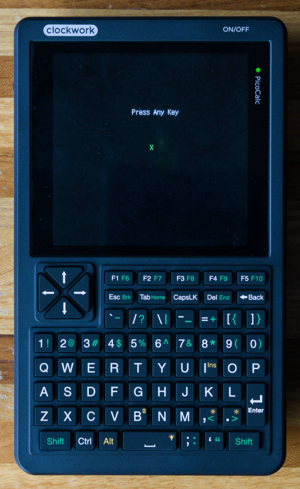
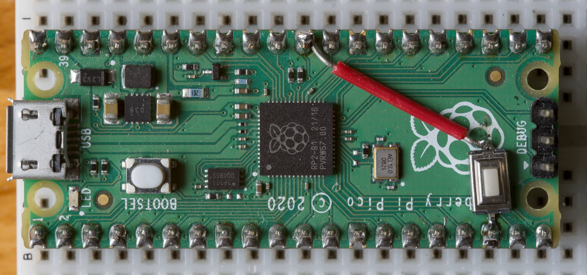
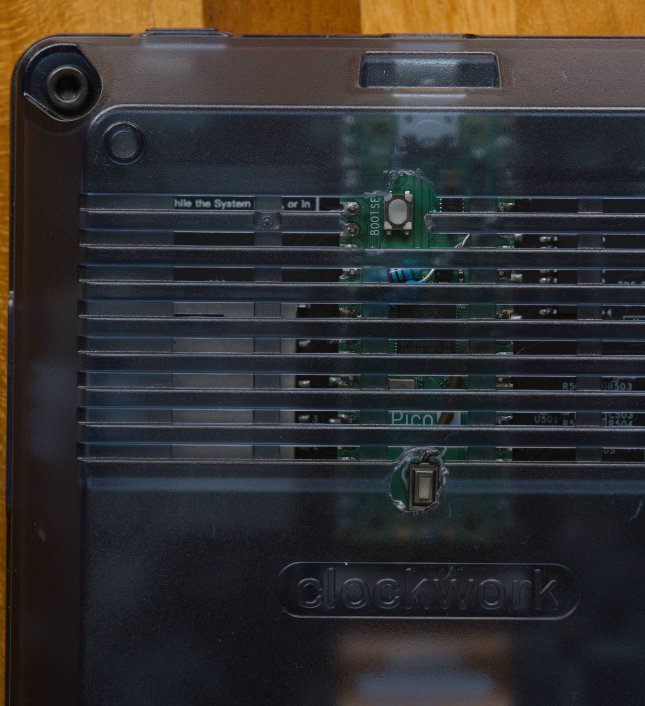

# Introduction

This project demonstrates how to use the PicoCalc with TinyGo. Specifically, it
writes a string to the LCD, then displays the characters you type.  It
intentionally uses as little code as possible so that it's easy to use as
a starting point for experimentation.

check out [main.go](main.go) to see the code.

# Prerequisites

- Install TinyGo using their [official instructions](https://tinygo.org/getting-started/install/).
- Optional (recommended): Do the [blinking light tutorial](https://tinygo.org/tour/blink/onboard/)
  with a pico on a breadboard.  The flash command is `tinygo flash -target=pico` (or `-target=pico2`)
- If you are new to Go or want a refresher, [Tour of Go](https://go.dev/tour/) can help.

# Uploading the Code (Flash)

The Pico that shipped with your PicoCalc likely has a fancy bootloader that can
run programs from an SD card. I'm not to that level with TinyGo and instead use
the "classic" flash process.  You might want to use a dedicated Pico for these
experiments to keep your original Pico unchanged.

If you are not familiar with preparing the Pico for flashing code, refer to the
"More Tips" section below.  The command to upload code is.

```bash
tinygo flash -target=pico -serial=uart
```

Use `-target=pico2` here and below if you are using a Pico 2.  If it works,
you'll see this:

 

# More Examples

Here is variant that prints "hello world" with no error checking:

```golang
package main

import (
	"image/color"
	"picocalc/ili948x"

	"tinygo.org/x/tinyfont"
	"tinygo.org/x/tinyfont/shnm"
)


func main() {
	lcd := ili948x.InitDisplay()
	tinyfont.WriteLine(
		lcd,
		&shnm.Shnmk12,
		130,
		100,
		"hello world",
		color.RGBA{255, 255, 255, 255})
	for {
	}
}
```

Here is an minimal version that echos PicoCalc keystrokes to the serial console.
Compile it with `tinygo flash -target=pico -serial=uart` (or `pico2`), then use
`tinygo monitor` to view the output (using the USB-C connection).  The PicoCalc
must be powered on for its keyboard to function.

```golang
package main

import (
	"picocalc/i2ckbd"
	"time"
)

func main() {
	var keyboard i2ckbd.I2CKbd
	_ = keyboard.Init()
	for {
		k, _ := keyboard.GetChar()
		if (k > 0) && (k <= 127) {
			print(string(rune(k)))
		}
		time.Sleep(20 * time.Millisecond)
	}
}
```


# More Tips

## Flashing New Code

Flashing a Pico installed in a PicoCalc is not convenient as there is no direct
access to the boot button. Some people created some advanced case mods with 3D
printing, etc.  Here I present a simple hack.

First, I superglued a SMD button to the Pico and soldered a jumper wire to
the reset pin, like this:



Now the Pico has a reset button. You can press reset while holding boot to
go into programming mode. If you don't want to do this mod, you can instead
do the classic "hold boot while plugging the cable" method.

For the next step, I simply drilled holes in the PicoCalc case where the
button(s) are.



Now to program, I do this:

1. Turn the picocalc upside down with the batteries removed.
2. Plug the micro USB programming cable between the PC and Pico
3. Using two tools (chopsticks, hex wrench, etc), hold down the boot button and press reset
4. Your Pico should mount as a USB drive on the PC.
5. Run `tingo flash -target=pico` (or whatever programming command you need)
6. Unplug the micro USB.
7. You can power the PicoCalc using either 18650 batteries or the USB-C port.

Why no batteries? PicoCalc hardware currently (11/2025) has a flaw. If
the PicoCalc is powered on with the micro USB attached, it will feed 5V to the
18650 batteries. This hardware bug can overcharge these batteries which you
want to avoid (Google "18650 overvoltage").

## Serial Communications

When using the USB-C port as a serial monitor (via `-serial=uart`), the
PicoCalc hardware attempts to charge any installed 18650 batteries. It will not
overcharge them in this case but can still pull a fair amount of current.
Running with the USB-C port and no batteries will avoid the high current draw.

## Troubleshooting / Debugging

If your uploaded go code panics (illegal array access, out of memory), it will
dump the panic address over the UART. Once you get the address, you may wonder
what to do with it. The answer is to disassemble the firmware so you can see
what the address to pointing to. The steps are:

    # replace target with pico2 if needed
    tinygo build -target=pico

    # your elf target might have a different name
    objdump -d picocalc.elf > picocalc.asm

Now you can see addresses in the `asm` file and find out what function threw
the panic.

If you want to try attaching a full debugger (which I have not gotten to trying yet),
instructions are [here](https://tinygo.org/docs/guides/debugging/).

## Cross compilation

I have a bigger TinyGo project which is a programmable scientific calculator.
It can run on either PC (compiled with traditional go) or the PicoCalc (using TinyGo):
[RPNGO](https://github.com/mattwach/rpngo)


You can check out the project sources for more in-depth go usage examples.
The main thing I'll talk about here is Go's use of build tags. The basic
pattern that you use [go build tags](https://pkg.go.dev/go/build) to define
files that will compile differently on PC and PicoCalc.  For example,
say you want to print to the terminal on PC and the LCD on PicoCalc.
You could make a PC version,

`printpc.go`:

```golang
//go:build !pico && !pico2

package console

func Print(msg string) {
	print(msg)
}
```

and a picocalc version in the same directory, `printpicocalc.go`:

```golang
//go:build pico && pico2

package console

func Print(msg string) {
	// do it the PicoCalc way...
}
```

and your code that want to print calls:

```
	console.Print("hello")
```

An alternate method is to use [go interfaces](https://gobyexample.com/interfaces).
This method involves creating an interface that your callers will use, then
create implementations of this interface for TinyGo and PC cases. The specific
object is instantiated in the initialization code which will be different between
the two cases.

RPNGO uses both interfaces and build tags for different aspects of the project.


